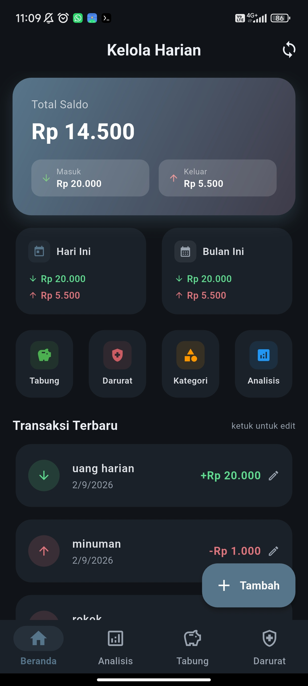
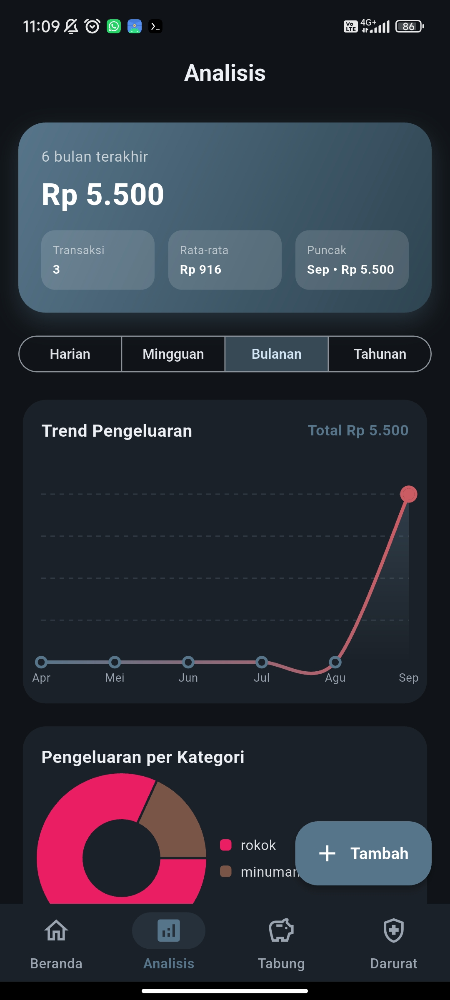
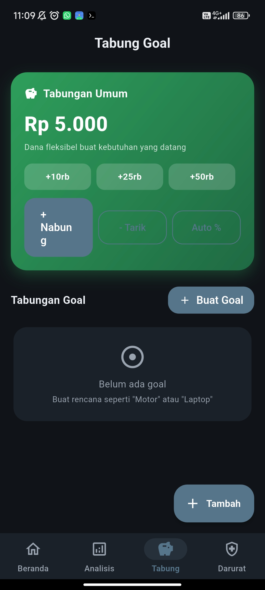
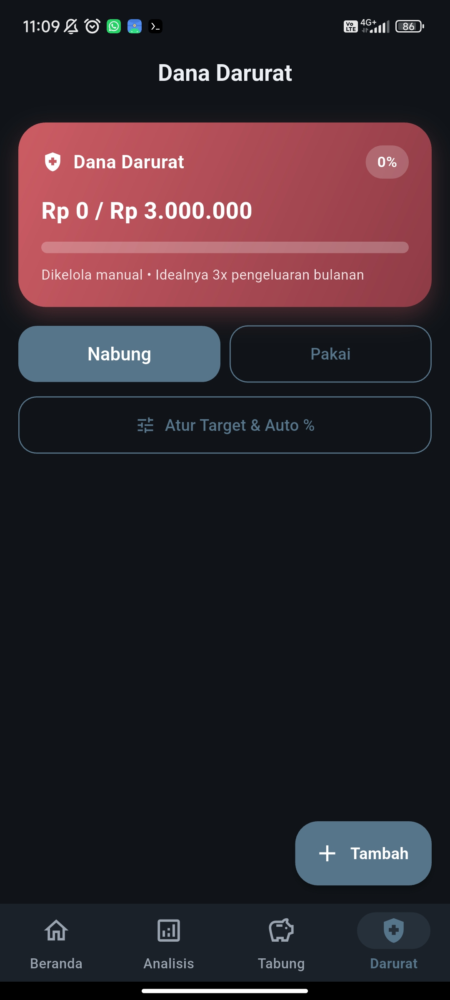
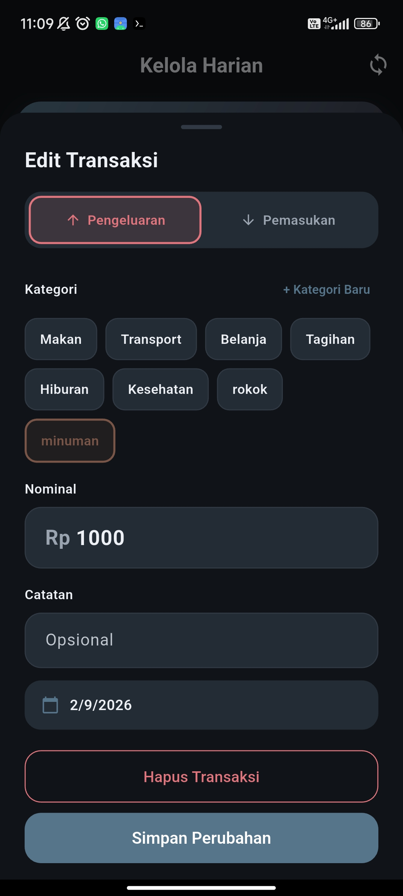
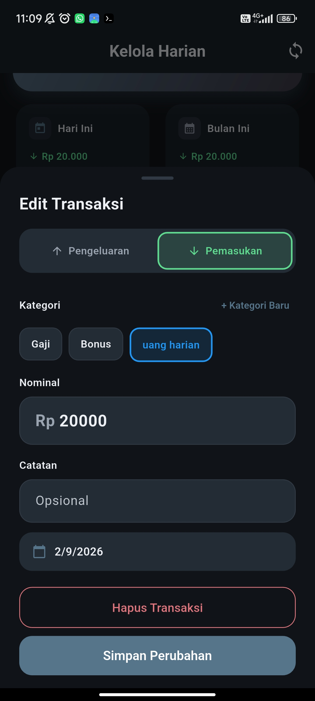

# Pengelola Harian

Aplikasi pengelola keuangan harian — catat pengeluaran & pemasukan, tabung ke goal, siapkan dana darurat, dan pantau kebiasaan belanja lewat analisis harian/mingguan/bulanan/tahunan.

## Tangkapan Layar

<p align="center">
  
  
  
  
  
  
</p>

## Fitur

- Catat pengeluaran & pemasukan harian, lengkap dengan kategori custom
- **Tabungan Umum** — dana fleksibel buat kebutuhan yang datang, quick-tabung 10rb/25rb/50rb sekali tap
- **Tabung Goal** — rencana nabung (mis. Motor, Laptop), bisa tanpa target
- **Dana Darurat** — target & auto sisihkan opsional
- Auto % dari pemasukan bersifat opsional (default 0 = atur manual)
- Analisis trend (harian/mingguan/bulanan/tahunan) + pie per kategori
- Edit & hapus transaksi langsung dari daftar terbaru
- Tema gelap/terang mengikuti sistem
- Sync multi-device via Supabase (email + Google + realtime) — data offline otomatis diadopsi ke akun saat login; skema di `supabase.sql`

## Supabase

URL: `https://gyvtqjhpbjbqizevavjw.supabase.co`

Untuk sync antar-device: jalankan `supabase.sql` di Supabase Dashboard &gt; SQL Editor, lalu login dengan akun yang sama di tiap device.

## Build

Push ke `main` → GitHub Actions build APK otomatis. Atau manual:

```bash
flutter pub get
dart run build_runner build
flutter build apk --release --dart-define SUPABASE_URL=... --dart-define SUPABASE_ANON=...
```

Hasil APK di `build/app/outputs/flutter-apk/app-release.apk`.